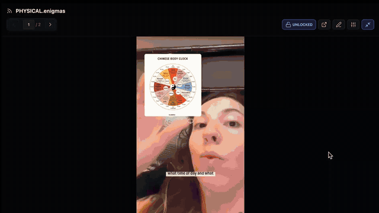

  
  
  <h1 align="center">CUSTOM FEED</h1>
  <h3 align="center"> Tʜᴇ Sᴏᴄɪᴀʟ Mᴇᴅɪᴀ-Sᴛʏʟᴇ Iɴᴛᴇʀᴀᴄᴛɪᴠᴇ Mᴇᴅɪᴀ Sᴛʀᴇᴀᴍ </h3>

  <!-- TOP PURPLE LINKS -->
  
  
  
   
  <!-- BOTTOM GOLD TAXONOMY -->
  
  
  
  

  

    <i> A highly specialized media viewer that parses a designated markdown file to create a browsable, scrolling "feed-like" experience for embedded content with platform-specific iframe auto-tuning. </i>
  

  

Welcome to **Custom Feed**, the production-grade visualizer designed to simulate the look and feel of modern social media platforms (e.g., YouTube, Instagram, TikTok, Snapchat, Warpcast, X) inside Obsidian. By dynamically applying platform-specific dimensions, scales, and offsets to embedded iframes, it combines an advanced presentation layer with robust gesture navigation, inline text block editing, and highly configurable real-time tuning parameters.

---

## ✨ Features

### 🛡️ Runtime & Agentic Safety
*   🖥️ **Safe FullTab Reparenting Hook**: Utilizes the modern `useFullTab` portal-style reparenting hook to safely mount the player container directly into Obsidian's active `.view-content` leaf, preserving native leaf headers instead of forcibly covering them.
*   🚫 **Impeccable Status Suppression**: Dynamically injects global stylesheet overrides to hide the `.status-bar` and `.view-footer` when fullscreen view is engaged, eliminating visual distractions while keeping host workspaces unaffected.
*   🧹 **Fail-Safe Cleanup Lifecycles**: Automatically intercepts leaf unmounts and active workspace view switches to clean up injected CSS rules, reset spacing margins, and restore containers to their original DOM tree positions.
*   👆 **Fluid Touch & Gesture Controls**: Native event capture listeners (`touchstart`, `touchmove`, `touchend`) support smooth scrolling and swipe navigation on tablet and mobile touch interfaces.

### 🔐 Security & Integrations
*   🔒 **Iframe Sandbox Security**: Enforces complete sandboxing constraints on child iframes with standard permissions (`allow-scripts`, `allow-same-origin`) to guard vault stability and block malicious script execution.
*   🖱️ **Dynamic Pointer-Lock Toggling**: Lets you toggle pointer events (`pointer-events: none` vs. `auto`) to secure scroll stability, ensuring you can swipe smoothly past iframes without triggering accidental micro-clicks inside them.
*   📝 **Safe Local File Modification**: Handles inline text block adjustments using the native Obsidian vault API (`app.vault.modify`) to edit specific file segments instead of rewriting entire files.

### 📐 User Interface & Developer Loop
*   🌌 **Curated OLED Theme Layout**: Outfitted in a premium dark mode styled with deep HSL tones (`hsl(220, 20%, 4%)`) and glowing purple accents, offering a fatigue-free viewing experience.
*   🫧 **Glassmorphic Floating Control Bar**: A floating header with backdrop filters (`backdrop-filter: blur(20px)`) that aggregates page controllers, locks, edits, tuning sliders, and maximizers.
*   📐 **Real-time Iframe Tuning**: Built-in sliders let you adjust Container Width/Height, Iframe Width/Height, Scale, and Left/Top Offsets in real-time, allowing you to instantly align and crop any third-party media embed.
*   💻 **Monospace Inline Editor**: Slide-out drawer that loads the raw markdown of the currently viewed section for rapid in-app annotation edits.

---

## 📦 Directory Index & Components

The package exposes the following compiled files:

| File | Description |
| :--- | :--- |
| **[CUSTOM FEED.md](CUSTOM%20FEED.md)** | The primary Obsidian Leaf Loader entry point that resolves and loads the visualizer view. |
| **[src/index.jsx](src/index.jsx)** | Standardized React visualizer codebase comprising iframe auto-tuning, inline file editor, and full-tab reparenting hook. |
| **[data/](data/)** | Local data directory holding folder-independent markdown media feeds (e.g. `PHYSICAL.enigmas..md`). |
| **[METADATA.md](METADATA.md)** | Machine-readable indexing manifest outlining taxonomy, type, logic, and security levels. |
| **[assets/custom_feed.webp](assets/custom_feed.webp)** | High-fidelity static thumbnail preview. |
| **[assets/customfeed.clip.gif](assets/customfeed.clip.gif)** | Fluid walkthrough loop GIF (under 2MB). |
| **[CONTRIBUTION.md](CONTRIBUTION.md)** | Standardized contributor documentation outlining VCS, media pipelines, and development standards. |
| **[LICENSE.md](LICENSE.md)** | Open-source MIT License. |
